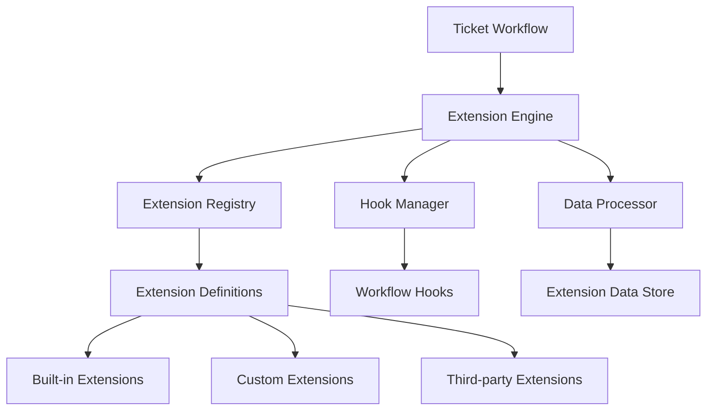
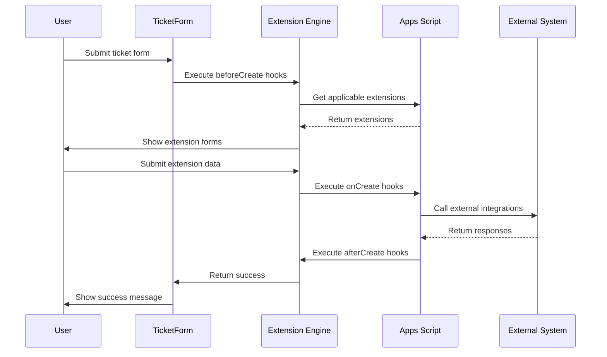
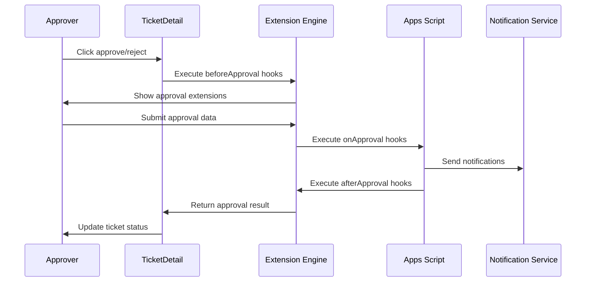

# Extensions Framework Documentation

## 📋 **Overview**

**Status**: 🏗️ **DESIGN SPECIFICATION** - Parked for Future Implementation
**Target Phase**: Phase 8+ (Post-Core Workflow Implementation)
**Last Updated**: September 16, 2025
**Complexity**: High - Major architectural enhancement
**Distinction**: **Automated API-based integrations** (vs Phase 7 manual external app tasks)

The Extensions Framework will enable dynamic, configurable extensions that can hook into any workflow step (ticket creation, approval steps, final approval) to collect additional data, perform **automated API integrations**, and execute custom business logic per ticket type.

## 🔄 **Relationship to Phase 7 External App Integration**

### **Two Different Integration Approaches:**

| Feature | Phase 7 External Apps (Manual) | Extensions Framework (Automated) |
|---------|--------------------------------|----------------------------------|
| **Execution** | Human-driven task completion | Automated API execution |
| **Workflow** | **Pauses** until manual completion | **Continues** after execution |
| **Integration** | User navigates to external app | System makes API calls |
| **Implementation** | `workflow_steps.step_type: 'task'` | Hook-based extension system |
| **Availability** | Any workflow step (not creation) | Any hook point including creation |
| **Purpose** | Manual tasks in external systems | Automated data sync/notifications |
| **Complexity** | Simple - URL + completion flag | Complex - Full API integration framework |

### **Complementary Systems:**
- **Phase 7**: Manual external tasks that require human interaction
- **Extensions Framework**: Automated background integrations and data processing

---

## 🎯 **Core Objectives**

### **Primary Goals**
- Enable **per-ticket-type extensions** at any workflow step
- Support **additional data collection** during workflow transitions
- Facilitate **external system integrations** (APIs, webhooks, notifications)
- Provide **flexible configuration** without code changes
- Maintain **backward compatibility** with existing ticket system

### **Extension Capabilities**
- **Data Collectors**: Dynamic forms, API data fetching, file uploads
- **Integrators**: External API calls, webhook notifications, email alerts
- **Validators**: Custom business logic validation, compliance checks
- **Transformers**: Data processing, enrichment, formatting
- **Notifiers**: Real-time notifications, status updates, reporting

---

## 🏗️ **Architecture Overview**

### **System Components**



### **Integration Points**

| Workflow Step | Hook Points | Extension Types |
|---------------|-------------|-----------------|
| **Ticket Creation** | `beforeCreate`, `onCreate`, `afterCreate` | Data Collection, Validation |
| **Approval Steps** | `beforeApproval`, `onApproval`, `afterApproval` | Integration, Notification |
| **Final Approval** | `beforeFinal`, `onFinal`, `afterFinal` | Completion, Integration |
| **Status Changes** | `beforeStatusChange`, `onStatusChange`, `afterStatusChange` | Workflow, Notification |
| **Data Updates** | `beforeUpdate`, `onUpdate`, `afterUpdate` | Validation, Sync |

---

## 📊 **Data Architecture**

### **New Google Sheets Tables**

#### **1. `extensions` Sheet**
```
Column A: id (Primary Key)
Column B: name (Extension Name)
Column C: type (data_collector|integrator|validator|transformer|notifier)
Column D: category (built_in|custom|third_party)
Column E: config_schema (JSON schema for configuration)
Column F: default_config (Default configuration JSON)
Column G: code_url (URL to extension code/handler)
Column H: version (Extension version)
Column I: active (boolean)
Column J: created_date (ISO timestamp)
Column K: updated_date (ISO timestamp)
Column L: created_by (User email)
```

#### **2. `ticket_type_extensions` Sheet**
```
Column A: id (Primary Key)
Column B: ticket_type_id (FK to ticket_types)
Column C: extension_id (FK to extensions)
Column D: workflow_step (create|approval_step_1|approval_step_2|final_approval)
Column E: hook_point (before|on|after)
Column F: execution_order (Integer for ordering)
Column G: config (Extension-specific configuration JSON)
Column H: conditions (JSON conditions for execution)
Column I: active (boolean)
Column J: created_date (ISO timestamp)
Column K: created_by (User email)
```

#### **3. `extension_executions` Sheet**
```
Column A: id (Primary Key)
Column B: ticket_id (FK to tickets)
Column C: extension_id (FK to extensions)
Column D: workflow_step (Step where executed)
Column E: hook_point (Hook point executed)
Column F: status (pending|success|failed|skipped)
Column G: input_data (Input data JSON)
Column H: output_data (Output data JSON)
Column I: error_message (Error details if failed)
Column J: execution_time_ms (Execution duration)
Column K: executed_at (ISO timestamp)
Column L: executed_by (User email)
```

#### **4. `extension_data` Sheet**
```
Column A: id (Primary Key)
Column B: ticket_id (FK to tickets)
Column C: extension_id (FK to extensions)
Column D: data_key (Data field identifier)
Column E: data_value (Field value)
Column F: data_type (text|number|date|boolean|json|file)
Column G: workflow_step (Step where collected)
Column H: collected_at (ISO timestamp)
Column I: collected_by (User email)
```

---

## 🔧 **Extension Types**

### **1. Data Collector Extensions**

**Purpose**: Collect additional data during workflow steps

**Configuration Schema**:
```json
{
  "fields": [
    {
      "id": "approval_reason",
      "type": "textarea",
      "label": "Approval Reason",
      "required": true,
      "placeholder": "Enter reason for approval/rejection"
    },
    {
      "id": "estimated_hours",
      "type": "number",
      "label": "Estimated Hours",
      "min": 0,
      "max": 1000
    }
  ],
  "display": {
    "title": "Additional Information Required",
    "description": "Please provide the following details"
  }
}
```

**Use Cases**:
- Approval reasoning forms
- Budget estimation fields
- Risk assessment questionnaires
- Compliance checklists

### **2. Integrator Extensions**

**Purpose**: Integrate with external systems and APIs

**Configuration Schema**:
```json
{
  "api": {
    "url": "https://api.external-system.com/tickets",
    "method": "POST",
    "headers": {
      "Authorization": "Bearer {API_TOKEN}",
      "Content-Type": "application/json"
    },
    "timeout": 30000
  },
  "mapping": {
    "ticket_id": "{{ticket.id}}",
    "title": "{{ticket.title}}",
    "status": "{{ticket.status}}"
  },
  "retry": {
    "attempts": 3,
    "delay": 5000
  }
}
```

**Use Cases**:
- CRM system synchronization
- Project management tool updates
- Accounting system integration
- Notification services (Slack, Teams, Email)

### **3. Validator Extensions**

**Purpose**: Custom validation logic for tickets

**Configuration Schema**:
```json
{
  "rules": [
    {
      "condition": "ticket.priority === 'urgent'",
      "validation": "ticket.assignee_email !== null",
      "message": "Urgent tickets must have an assignee"
    },
    {
      "condition": "ticket.company_id === 'enterprise_client'",
      "validation": "ticket.due_date !== null",
      "message": "Enterprise clients must have due dates"
    }
  ],
  "blocking": true
}
```

**Use Cases**:
- Business rule enforcement
- Compliance validation
- SLA requirement checks
- Data completeness verification

### **4. Transformer Extensions**

**Purpose**: Process and transform ticket data

**Configuration Schema**:
```json
{
  "transformations": [
    {
      "field": "title",
      "operation": "uppercase",
      "condition": "ticket.priority === 'urgent'"
    },
    {
      "field": "description",
      "operation": "append",
      "value": "\n\n[Auto-generated ID: {{ticket.id}}]"
    }
  ],
  "triggers": ["create", "update"]
}
```

**Use Cases**:
- Ticket ID generation
- Auto-categorization
- Data standardization
- Field calculations

### **5. Notifier Extensions**

**Purpose**: Send notifications and updates

**Configuration Schema**:
```json
{
  "channels": [
    {
      "type": "email",
      "to": "{{ticket.assignee_email}}",
      "template": "ticket_assigned",
      "condition": "status === 'assigned'"
    },
    {
      "type": "webhook",
      "url": "https://hooks.slack.com/services/...",
      "payload": {
        "text": "Ticket {{ticket.id}} needs attention"
      }
    }
  ],
  "throttling": {
    "max_per_hour": 10
  }
}
```

**Use Cases**:
- Email notifications
- Slack/Teams alerts
- SMS notifications
- Dashboard updates

---

## ⚙️ **Extension Engine**

### **Core Engine Components**

#### **1. Extension Registry**
```javascript
// Manages extension definitions and configurations
class ExtensionRegistry {
  async getExtensions(ticketTypeId, workflowStep, hookPoint) {
    // Fetch applicable extensions for current context
  }

  async registerExtension(extension) {
    // Register new extension
  }

  async validateConfig(extensionId, config) {
    // Validate extension configuration
  }
}
```

#### **2. Hook Manager**
```javascript
// Manages workflow hook execution
class HookManager {
  async executeHooks(context, hookPoint) {
    // Execute all applicable extensions for hook point
  }

  async executeExtension(extension, context) {
    // Execute single extension with error handling
  }

  async handleError(extension, error, context) {
    // Handle extension execution errors
  }
}
```

#### **3. Data Processor**
```javascript
// Handles extension data persistence and retrieval
class DataProcessor {
  async storeExtensionData(ticketId, extensionId, data) {
    // Store extension-collected data
  }

  async getExtensionData(ticketId, extensionId) {
    // Retrieve extension data for ticket
  }

  async mergeExtensionData(ticketData, extensionData) {
    // Merge extension data with ticket data
  }
}
```

---

## 🔌 **Built-in Extensions**

### **1. Approval Comments Extension**
- **Type**: Data Collector
- **Hook Points**: `beforeApproval`, `beforeFinal`
- **Purpose**: Collect approval/rejection reasons
- **Fields**: Comment text, approval decision

### **2. Email Notification Extension**
- **Type**: Notifier
- **Hook Points**: `onCreate`, `onApproval`, `onFinal`
- **Purpose**: Send email notifications to stakeholders
- **Configuration**: Recipient rules, email templates

### **3. SLA Tracking Extension**
- **Type**: Transformer + Validator
- **Hook Points**: `onCreate`, `onStatusChange`
- **Purpose**: Calculate and enforce SLA requirements
- **Features**: Due date calculation, SLA breach alerts

### **4. Audit Log Extension**
- **Type**: Transformer
- **Hook Points**: All hook points
- **Purpose**: Comprehensive audit trail
- **Data**: User actions, data changes, timestamps

### **5. Integration Bridge Extension**
- **Type**: Integrator
- **Hook Points**: `afterCreate`, `afterApproval`, `afterFinal`
- **Purpose**: Generic webhook/API integration
- **Configuration**: Endpoint URLs, data mappings

---

## 🛠️ **Implementation Architecture**

### **Frontend Changes (React)**

#### **1. Extension Form Renderer**
```javascript
// src/components/extensions/ExtensionRenderer.js
const ExtensionRenderer = ({ extensions, context, onExtensionData }) => {
  // Render extension forms dynamically
  // Handle extension data collection
  // Validate extension inputs
};
```

#### **2. Extension Configuration UI**
```javascript
// src/components/admin/ExtensionConfig.js
const ExtensionConfig = ({ ticketType }) => {
  // Configure extensions per ticket type
  // Set workflow step bindings
  // Test extension configurations
};
```

#### **3. Extension Data Display**
```javascript
// src/components/tickets/ExtensionDataView.js
const ExtensionDataView = ({ ticketId, extensions }) => {
  // Display extension-collected data
  // Show execution history
  // Handle extension errors
};
```

### **Backend Changes (Apps Script)**

#### **1. Extension Execution Engine**
```javascript
// Extension execution pipeline
function executeWorkflowHooks(ticketData, workflowStep, hookPoint) {
  const extensions = getApplicableExtensions(ticketData.ticket_type_id, workflowStep, hookPoint);

  for (const ext of extensions) {
    try {
      const result = executeExtension(ext, ticketData, workflowStep, hookPoint);
      logExtensionExecution(ext.id, ticketData.id, result);
    } catch (error) {
      handleExtensionError(ext, error, ticketData);
    }
  }
}
```

#### **2. Extension API Endpoints**
```javascript
// API endpoints for extension management
function handleExtensionRequest(operation, data) {
  switch(operation) {
    case 'execute_hooks':
      return executeWorkflowHooks(data.ticket, data.step, data.hook);
    case 'get_extensions':
      return getExtensions(data.ticket_type_id);
    case 'configure_extension':
      return configureExtension(data.ticket_type_id, data.extension_id, data.config);
  }
}
```

---

## 🔄 **Execution Flow**

### **Ticket Creation Flow with Extensions**


### **Approval Step Flow with Extensions**


---

## 📋 **Configuration Examples**

### **Example 1: Budget Approval Extension**
```json
{
  "extension_id": "budget_approval",
  "ticket_type_id": "purchase_request",
  "workflow_step": "approval_step_1",
  "hook_point": "before",
  "config": {
    "fields": [
      {
        "id": "budget_amount",
        "type": "number",
        "label": "Budget Amount",
        "required": true,
        "min": 0,
        "currency": "PHP"
      },
      {
        "id": "budget_justification",
        "type": "textarea",
        "label": "Budget Justification",
        "required": true,
        "maxLength": 500
      }
    ],
    "validation": {
      "rules": [
        {
          "condition": "budget_amount > 50000",
          "requirement": "budget_justification.length > 100",
          "message": "High-budget items require detailed justification"
        }
      ]
    }
  },
  "conditions": {
    "priority": ["high", "urgent"],
    "department": ["finance", "procurement"]
  }
}
```

### **Example 2: CRM Integration Extension**
```json
{
  "extension_id": "crm_sync",
  "ticket_type_id": "customer_issue",
  "workflow_step": "final_approval",
  "hook_point": "after",
  "config": {
    "api": {
      "url": "https://api.crm-system.com/tickets",
      "method": "POST",
      "headers": {
        "Authorization": "Bearer {{CRM_API_TOKEN}}",
        "Content-Type": "application/json"
      }
    },
    "mapping": {
      "external_id": "{{ticket.id}}",
      "customer_email": "{{ticket.company.primary_email}}",
      "issue_type": "{{ticket.ticket_type.name}}",
      "resolution": "{{extension_data.resolution_notes}}",
      "resolved_at": "{{ticket.updated_date}}"
    },
    "retry": {
      "attempts": 3,
      "delay": 5000,
      "backoff": "exponential"
    }
  }
}
```

### **Example 3: SLA Monitoring Extension**
```json
{
  "extension_id": "sla_monitor",
  "ticket_type_id": "*",
  "workflow_step": "create",
  "hook_point": "after",
  "config": {
    "sla_rules": [
      {
        "priority": "urgent",
        "response_time_hours": 1,
        "resolution_time_hours": 4
      },
      {
        "priority": "high",
        "response_time_hours": 4,
        "resolution_time_hours": 24
      },
      {
        "priority": "medium",
        "response_time_hours": 24,
        "resolution_time_hours": 72
      }
    ],
    "notifications": {
      "escalation_points": [0.5, 0.8, 1.0],
      "recipients": ["{{ticket.assignee_email}}", "supervisor@company.com"]
    }
  }
}
```

---

## 🔒 **Security Considerations**

### **Extension Isolation**
- Extensions execute in sandboxed environment
- Limited API access permissions
- Input validation and sanitization
- Output filtering and encoding

### **Access Control**
- RBAC integration for extension configuration
- User permissions for extension execution
- Audit logging for all extension activities
- Secure credential management for integrations

### **Data Protection**
- Encryption of sensitive extension data
- PII handling compliance
- Data retention policies
- Secure API communication (HTTPS only)

---

## 🧪 **Testing Strategy**

### **Unit Testing**
- Extension execution engine
- Data validation functions
- API integration handlers
- Error handling mechanisms

### **Integration Testing**
- Workflow hook execution
- External system integration
- Data persistence and retrieval
- Cross-extension interactions

### **End-to-End Testing**
- Complete workflow scenarios
- Multi-step extension chains
- Error recovery testing
- Performance under load

---

## 📈 **Performance Considerations**

### **Execution Optimization**
- Parallel extension execution where possible
- Caching of extension configurations
- Lazy loading of extension code
- Timeout handling for long-running extensions

### **Scalability**
- Extension execution rate limiting
- Resource usage monitoring
- Database query optimization
- Background processing for non-blocking operations

---

## 🚀 **Implementation Phases**

### **Phase 7A: Extension Infrastructure (3 weeks)**
- [ ] Database schema creation
- [ ] Extension registry implementation
- [ ] Basic hook manager
- [ ] Core data structures

### **Phase 7B: Extension Engine (2 weeks)**
- [ ] Extension execution pipeline
- [ ] Error handling system
- [ ] Data persistence layer
- [ ] API integration framework

### **Phase 7C: Frontend Integration (2 weeks)**
- [ ] Extension form renderer
- [ ] Dynamic field injection
- [ ] Extension data display
- [ ] User interface updates

### **Phase 7D: Built-in Extensions (2 weeks)**
- [ ] Approval comments extension
- [ ] Email notification extension
- [ ] SLA tracking extension
- [ ] Audit logging extension

### **Phase 7E: Admin Interface (1 week)**
- [ ] Extension configuration UI
- [ ] Testing and debugging tools
- [ ] Extension marketplace view
- [ ] Documentation and help

### **Phase 7F: Testing & Documentation (1 week)**
- [ ] Comprehensive testing suite
- [ ] Performance optimization
- [ ] Security review
- [ ] User documentation

---

## 📚 **API Reference**

### **Extension Configuration API**
```javascript
// Get extensions for ticket type
GET /api/extensions?ticket_type_id={id}&workflow_step={step}

// Configure extension for ticket type
POST /api/extensions/configure
{
  "ticket_type_id": "string",
  "extension_id": "string",
  "workflow_step": "string",
  "hook_point": "string",
  "config": {},
  "conditions": {}
}

// Execute workflow hooks
POST /api/extensions/execute
{
  "ticket_id": "string",
  "workflow_step": "string",
  "hook_point": "string",
  "context": {}
}
```

### **Extension Data API**
```javascript
// Store extension data
POST /api/extensions/data
{
  "ticket_id": "string",
  "extension_id": "string",
  "data": {},
  "workflow_step": "string"
}

// Retrieve extension data
GET /api/extensions/data?ticket_id={id}&extension_id={ext_id}

// Get extension execution history
GET /api/extensions/executions?ticket_id={id}
```

---

## 🔧 **Migration Strategy**

### **Backward Compatibility**
- Existing tickets remain unchanged
- Current custom fields preserved
- Gradual extension adoption
- Rollback capability maintained

### **Data Migration**
- Custom fields to extension data mapping
- Historical ticket data preservation
- Configuration backup and restore
- Zero-downtime deployment

---

## 📊 **Monitoring & Analytics**

### **Extension Metrics**
- Execution success/failure rates
- Performance benchmarks
- Usage statistics per extension
- Error frequency and patterns

### **Business Intelligence**
- Extension effectiveness analysis
- Workflow optimization insights
- Integration success metrics
- User adoption tracking

---

## 🎯 **Success Criteria**

### **Technical Success**
- [ ] 99%+ extension execution reliability
- [ ] Sub-500ms average extension execution time
- [ ] Zero security vulnerabilities
- [ ] 100% backward compatibility

### **Business Success**
- [ ] Reduced manual data entry by 80%
- [ ] Improved workflow compliance to 95%
- [ ] External system integration coverage 100%
- [ ] User satisfaction score > 4.5/5

---

## 📝 **Future Enhancements**

### **Advanced Features**
- Visual extension builder (drag-and-drop)
- Machine learning-powered recommendations
- Real-time collaboration extensions
- Mobile-specific extension interfaces

### **Enterprise Features**
- Extension marketplace
- Version management and rollback
- A/B testing for extensions
- Advanced analytics and reporting

---

## 📋 **Conclusion**

The Extensions Framework represents a significant architectural enhancement that will transform the JarvisByERP ticketing system from a static workflow tool into a dynamic, extensible business process platform.

**Key Benefits**:
- **Flexibility**: Adapt to changing business requirements without code changes
- **Integration**: Seamlessly connect with existing business systems
- **Scalability**: Support complex, multi-step approval workflows
- **Compliance**: Enforce business rules and compliance requirements
- **Efficiency**: Automate repetitive tasks and data collection

**Implementation Complexity**: High - requires 6-9 weeks of development across multiple system layers

**Recommendation**: Park for future implementation after core system is fully deployed and stable in production environment.

---

**Status**: 📋 **COMPREHENSIVE DESIGN COMPLETE** - Ready for Future Implementation
**Last Updated**: September 16, 2025
**Next Review**: After Phase 7 Workflow Engine Implementation
**Related Documentation**: See `EXTERNAL_APP_INTEGRATION.md` for Phase 7 manual external app tasks

*This framework specification provides the complete blueprint for implementing a robust, scalable **automated** extension system that complements the Phase 7 manual external app integration, enabling comprehensive business workflow automation while maintaining system integrity and performance.*